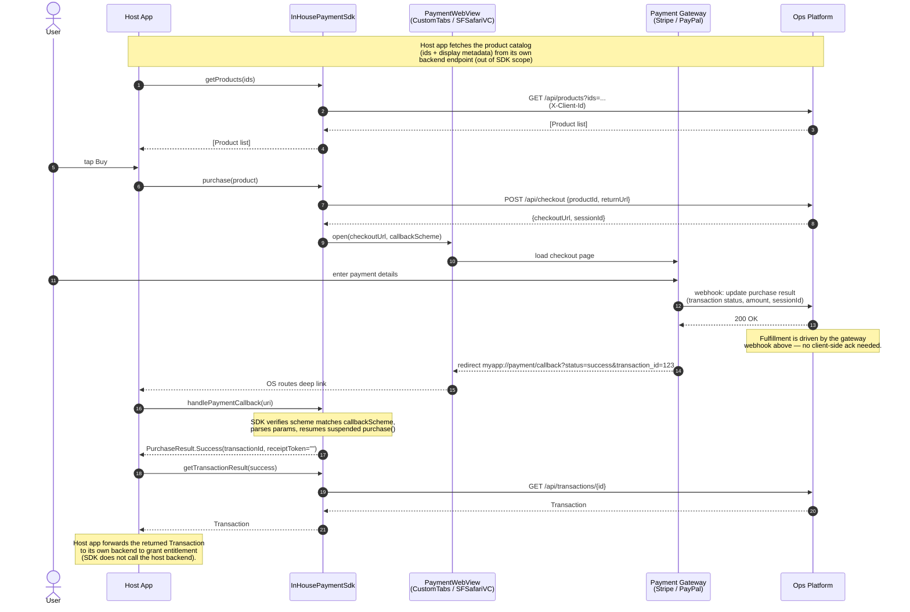
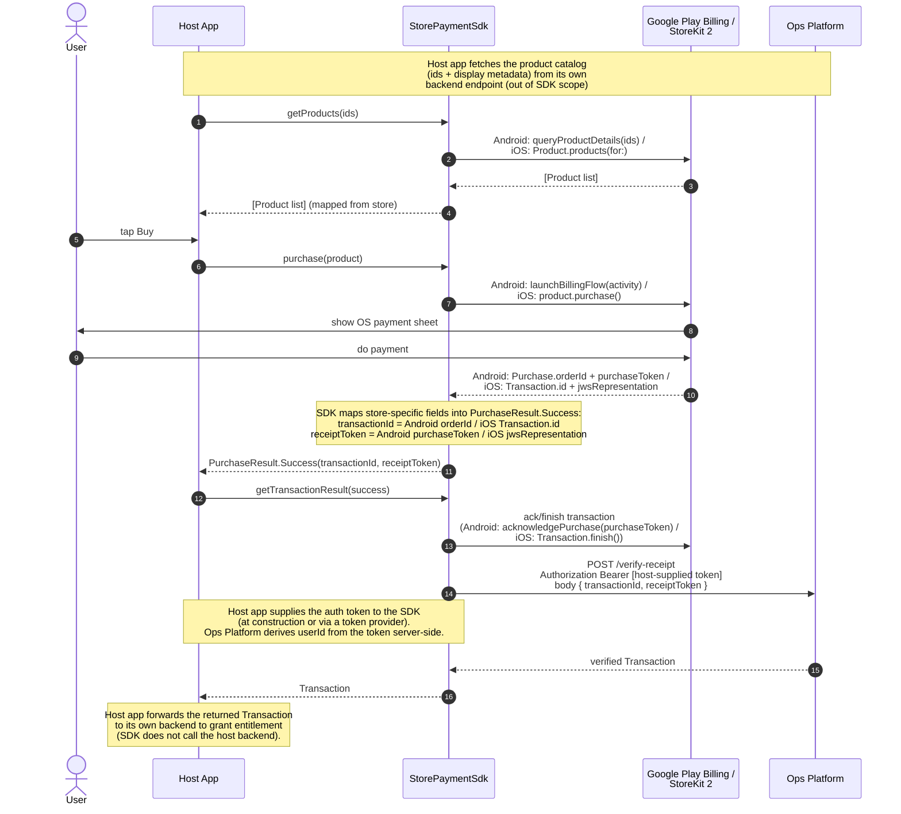

# Payment SDK — Architecture Plan

A Kotlin Multiplatform payment SDK with two tracks: **store billing** (Google Play / Apple StoreKit) and **in-house payment gateway** (Stripe / PayPal via system browser). Both tracks implement a single `PaymentSdk` interface.

---

## Architecture Overview

```
                        ┌─────────────────┐
                        │   PaymentSdk    │   ← commonMain interface
                        │   (interface)   │
                        └────────┬────────┘
                                 │
                 ┌───────────────┴───────────────┐
                 │                               │
        ┌─────────────────┐             ┌─────────────────┐
        │ StorePaymentSdk │             │InHousePaymentSdk│
        │  (per-platform  │             │  (fully in KMP  │
        │   app wrapper)  │             │  shared module) │
        └────────┬────────┘             └────────┬────────┘
                 │                               │
        ┌────────┴─────────┐         ┌───────────┴───────────┐
        │ Google Play      │         │ internal:             │
        │ Billing (Android)│         │  InHouseOpsApiClient  │
        │ StoreKit 2 (iOS) │         │  PaymentWebView       │
        └──────────────────┘         │  (CustomTabs /        │
                                     │   SFSafariVC)         │
                                     └───────────────────────┘
```

| Aspect | StorePaymentSdk | InHousePaymentSdk |
|--------|-----------------|-------------------|
| **Lives in** | App layer (`sdkwrapper/`) | KMP shared module |
| **Checkout UI** | OS payment sheet | CustomTabsIntent / SFSafariViewController |
| **Internals hidden?** | N/A (platform SDK) | Yes — `InHouseOpsApiClient` and `PaymentWebView` are `internal` |
| **Constructor** | `StorePaymentSdk(activity, opsBaseUrl, authTokenProvider)` | `InHousePaymentSdk(context, clientId, opsBaseUrl)` — single class in `commonMain` |

**Caller flow is identical for both tracks:**

```
1. val products = sdk.getProducts(ids)         // render your own UI
2. val result   = sdk.purchase(product)        // SDK shows OS sheet or browser
3. val tx       = sdk.getTransactionResult(result) // SDK acks/finishes with the
                                                   // store + POSTs receipt to Ops
```

---

## 1. Shared Models (`commonMain`)

> `shared/src/commonMain/kotlin/com/example/paymentsdk/models/`

```kotlin
data class Product(
    val productId: String,
    val title: String,
    val description: String,
    val formattedPrice: String,
    val price: Double,
    val currencyCode: String,
    val discount: Discount? = null,
    val metadata: Map<String, String> = emptyMap()
)

data class Discount(
    val originalPrice: Double,
    val formattedOriginalPrice: String,
    val percentage: Int
)

sealed interface PurchaseResult {
    // transactionId = display id (iOS Transaction.id / Android Purchase.orderId / gateway tx id)
    // receiptToken  = server-verifiable receipt (iOS jwsRepresentation /
    //                 Android Purchase.purchaseToken / "" for in-house)
    data class Success(
        val transactionId: String,
        val receiptToken: String
    ) : PurchaseResult
    data object UserCanceled : PurchaseResult
    data class Error(val code: Int, val message: String) : PurchaseResult
}

data class Transaction(
    val transactionId: String,
    val productId: String,
    val receiptToken: String,
    val status: TransactionStatus,
    val purchasedAt: Long
)

enum class TransactionStatus {
    PENDING, COMPLETED, VERIFIED, FAILED
}
```

---

## 2. PaymentSdk Interface (`commonMain`)

> `shared/src/commonMain/kotlin/com/example/paymentsdk/PaymentSdk.kt`

```kotlin
interface PaymentSdk {
    // Host app fetches its product catalog from its own backend
    // first, then passes ids here. Both tracks require ids —
    // no "list all" API.
    suspend fun getProducts(productIds: List<String>): List<Product>
    suspend fun purchase(product: Product): PurchaseResult
    // Takes the full Success so both ids are available:
    // transactionId (iOS lookup) and receiptToken (Android lookup
    // + server primary key). Acks/finishes with the provider
    // and POSTs the receipt to the Ops Platform before returning.
    suspend fun getTransactionResult(purchase: PurchaseResult.Success): Transaction
}
```

---

## 3. InHousePaymentSdk (KMP shared module)

Fully in KMP. Single class in `commonMain` — no `expect/actual` needed for `InHousePaymentSdk` itself. Platform differences are handled by `expect/actual PlatformContext` and `expect/actual PaymentWebView` (both internal).

### 3a. Public API

```kotlin
// commonMain — single class, not expect/actual
class InHousePaymentSdk(
    context: PlatformContext,     // Android = Activity, iOS = empty class
    clientId: String,
    opsBaseUrl: String,
    callbackScheme: String = "myapp"
) : PaymentSdk {

    fun handlePaymentCallback(uri: String): Boolean   // forward URLs (SDK checks scheme)
}

// PlatformContext — the only expect/actual the caller sees
expect class PlatformContext
// androidMain: actual typealias PlatformContext = Activity
// iosMain:     actual class PlatformContext
```

### 3b. Internal Components (hidden from caller)

| Component | Visibility | Location | Role |
|-----------|-----------|----------|------|
| `InHouseOpsApiClient` | `internal` | `commonMain` (`inhouse/`) | Ktor HTTP client, sends `X-Client-Id` header |
| `PaymentWebView` | `internal` | `expect/actual` | Opens system browser, takes `PlatformContext` |
| `WebViewResult` | `internal` | `commonMain` | Sealed interface for browser result |
| `CheckoutInfo` | `internal` | `commonMain` | Checkout URL + session from backend |

### 3c. Sequence Diagram



**Cancellation path:** if the user dismisses the Custom Tab / SFSafariViewController without completing payment, the SDK's lifecycle observer detects the dismissal and resumes `purchase()` with `PurchaseResult.UserCanceled`.

### 3d. Host App Setup

**Android** — `AndroidManifest.xml` intent filter + `onNewIntent`/`onResume`:

```xml
<intent-filter>
    <action android:name="android.intent.action.VIEW" />
    <category android:name="android.intent.category.DEFAULT" />
    <category android:name="android.intent.category.BROWSABLE" />
    <data android:scheme="myapp" android:host="payment" android:pathPrefix="/callback" />
</intent-filter>
```

```kotlin
override fun onNewIntent(intent: Intent) {
    super.onNewIntent(intent)
    intent.data?.let { sdk.handlePaymentCallback(it.toString()) }
}
```

Dismissal detection (user pressing back from Custom Tab) is handled internally by the SDK via a lifecycle observer.

**iOS** — `Info.plist` URL scheme + `.onOpenURL`:

```xml
<key>CFBundleURLTypes</key>
<array><dict>
    <key>CFBundleURLSchemes</key>
    <array><string>myapp</string></array>
</dict></array>
```

```swift
.onOpenURL { url in
    sdk.handlePaymentCallback(uri: url.absoluteString)
}
```

### 3e. Backend API Contract

```
GET  /api/products?ids=prod_1,prod_2         → [Product]  (ids required)
POST /api/checkout  {productId, returnUrl}   → {checkoutUrl, sessionId, expiresAt}
GET  /api/transactions/{id}                  → Transaction
```

Fulfillment is driven by the gateway → backend webhook (see sequence diagram step 11), not by a client call.

All requests include `X-Client-Id` header (set automatically by the SDK from the `clientId` parameter).

---

## 4. StorePaymentSdk (app layer)

Lives in each platform's app module because the store SDKs cannot be abstracted via KMP:
- **Android:** Google Play Billing Library is Android-only
- **iOS:** StoreKit 2 is Swift-only (no Kotlin/Native interop)

Both implement `PaymentSdk`. See prototype code for full implementation.

### 4a. Sequence Diagram



**Cancellation path:** if the user dismisses the OS payment sheet, the store SDK returns a `USER_CANCELED` result, which `StorePaymentSdk` maps to `PurchaseResult.UserCanceled`.

---

## 5. Host App Integration

The ViewModel programs against `PaymentSdk` — the same code works for both tracks.

**Android:**

```kotlin
// Choose track
val paymentSdk: PaymentSdk = if (useStoreTrack) {
    StorePaymentSdk(
        activity = this,
        opsBaseUrl = "https://ops.example.com",
        // Ops Platform derives userId server-side from this token
        authTokenProvider = { authStore.currentAccessToken() }
    )
} else {
    InHousePaymentSdk(
        context = this,
        clientId = "your-company-id",
        opsBaseUrl = "https://ops.example.com"
    )
}

// ViewModel — identical for both tracks
class CheckoutViewModel(private val sdk: PaymentSdk) : ViewModel() {
    fun onBuyClicked(product: Product) {
        viewModelScope.launch {
            when (val result = sdk.purchase(product)) {
                is PurchaseResult.Success -> {
                    // SDK acks/finishes internally + POSTs receipt to Ops
                    val tx = sdk.getTransactionResult(result)
                    // Forward tx to your own backend to grant entitlement
                }
                is PurchaseResult.UserCanceled -> { /* idle */ }
                is PurchaseResult.Error -> { /* show error */ }
            }
        }
    }
}
```

**iOS:**

```swift
// Choose track
let paymentSdk: PaymentSdk = useStoreTrack
    ? StorePaymentSdk(
          opsBaseUrl: "https://ops.example.com",
          // Ops Platform derives userId server-side from this token
          authTokenProvider: { await AuthStore.shared.accessToken() }
      )
    : InHousePaymentSdk(
          context: PlatformContext(),
          clientId: "your-company-id",
          opsBaseUrl: "https://ops.example.com"
      )

// ViewModel — identical for both tracks
func onBuyClicked(product: Product) {
    Task {
        let result = try await paymentSdk.purchase(product: product)
        switch result {
        case let success as PurchaseResult.Success:
            // SDK acks/finishes internally + POSTs receipt to Ops
            let tx = try await paymentSdk.getTransactionResult(purchase: success)
            // Forward tx to your own backend to grant entitlement
        case is PurchaseResult.UserCanceled: break
        case let error as PurchaseResult.Error: /* show error */
        }
    }
}
```

---

## 6. Project Structure

```
shared/src/
├── commonMain/kotlin/com/example/paymentsdk/
│   ├── PaymentSdk.kt                                # public interface
│   ├── PlatformContext.kt                           # expect class
│   ├── models/
│   │   ├── Product.kt                               # public
│   │   ├── PurchaseResult.kt                        # public sealed interface
│   │   ├── Transaction.kt                           # public
│   │   └── CheckoutInfo.kt                          # internal
│   ├── store/
│   │   └── StoreOpsApiClient.kt                     # public (used by store wrappers)
│   └── inhouse/
│       ├── InHousePaymentSdk.kt                     # public class
│       ├── InHouseOpsApiClient.kt                   # internal
│       └── PaymentWebView.kt                        # internal expect
│
├── androidMain/kotlin/com/example/paymentsdk/
│   ├── PlatformContext.kt                           # actual typealias = Activity
│   └── inhouse/
│       └── PaymentWebView.kt                        # internal actual (CustomTabsIntent)
│
└── iosMain/kotlin/com/example/paymentsdk/
    ├── PlatformContext.kt                           # actual class (empty)
    └── inhouse/
        └── PaymentWebView.kt                        # internal actual (SFSafariViewController)

androidApp/.../app/
├── sdkwrapper/StorePaymentSdk.kt                   # Google Play Billing wrapper
├── MainActivity.kt                                  # picks track + deep link forwarding
├── CheckoutViewModel.kt                             # uses PaymentSdk interface
└── CheckoutScreen.kt                                # Composable

iosApp/
├── SdkWrapper/StorePaymentSdk.swift                # StoreKit 2 wrapper
├── PaymentApp.swift                                 # picks track + .onOpenURL forwarding
├── CheckoutViewModel.swift                          # uses PaymentSdk protocol
└── CheckoutView.swift                               # SwiftUI
```

---

## 7. Key Design Decisions

| Decision | Rationale |
|----------|-----------|
| **`sealed interface PurchaseResult`** | More flexible than sealed class. Uses `data object` for singletons. |
| **`InHouseOpsApiClient` + `PaymentWebView` are `internal`** | Caller only sees `InHousePaymentSdk(clientId, opsBaseUrl)`. No leaking of HTTP client or browser details. |
| **Single class + `PlatformContext`** | `InHousePaymentSdk` is one class in `commonMain` (not expect/actual). `expect class PlatformContext` abstracts the Android `Activity` dependency. All business logic in one place. |
| **`handlePaymentCallback()` checks scheme internally** | Caller forwards all URLs blindly. SDK matches against `callbackScheme` and returns `Boolean`. |
| **CustomTabsIntent / SFSafariViewController** | System browser sandbox, visible URL bar, shared cookies. More secure than in-app WebView for payments. |
| **`CompletableDeferred` bridging** | `purchase()` suspends. Deep link arrives asynchronously via `handlePaymentCallback()`. `CompletableDeferred` bridges the two. |
| **StorePaymentSdk in app layer** | StoreKit 2 is Swift-only, Google Play Billing is Android-only. Cannot be KMP-ified. |
